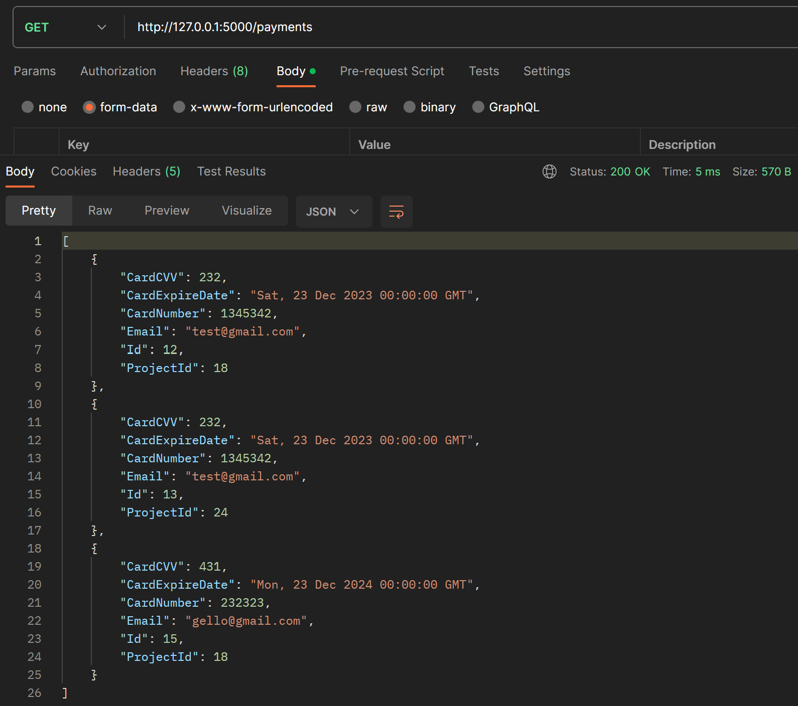
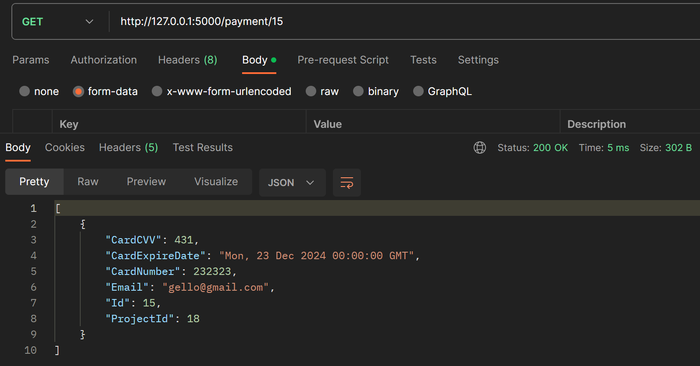
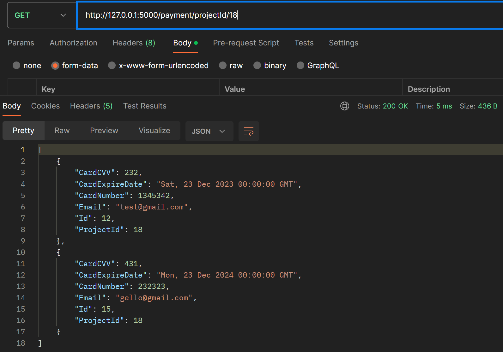
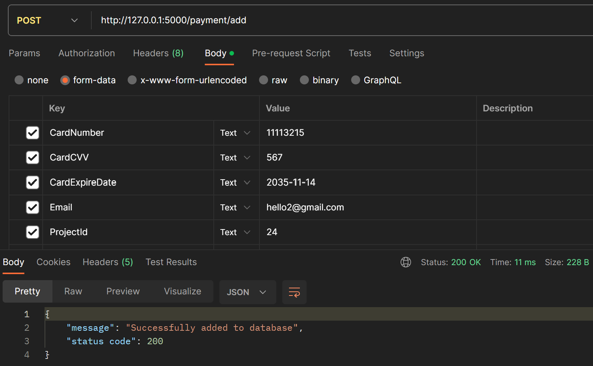
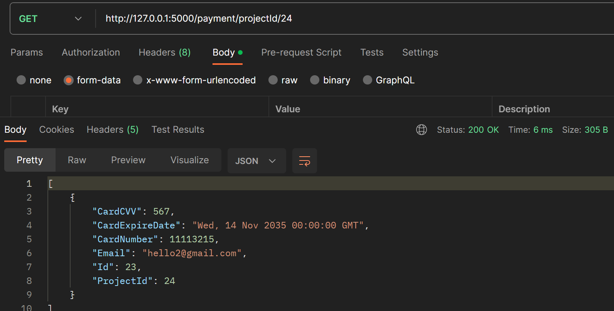
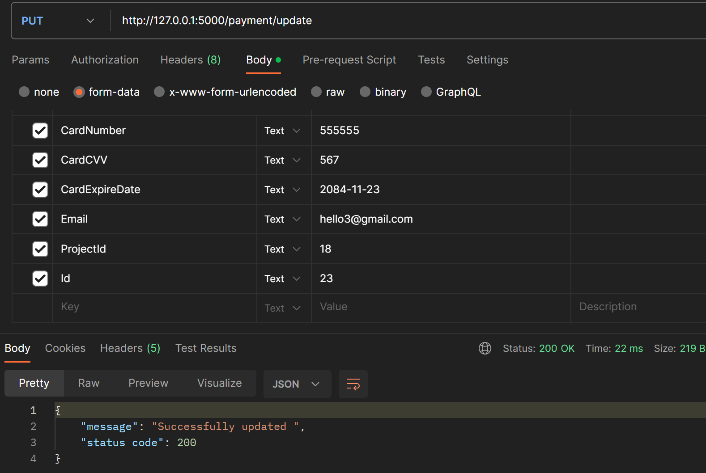
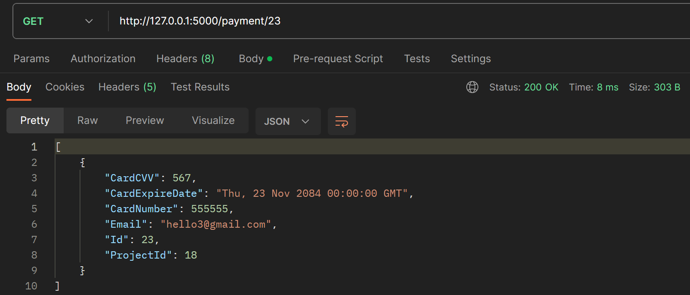
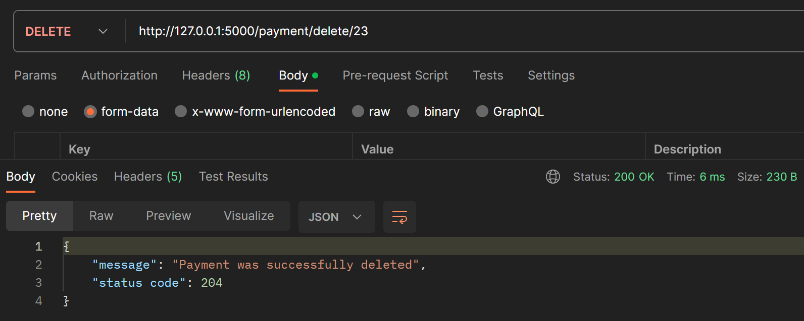
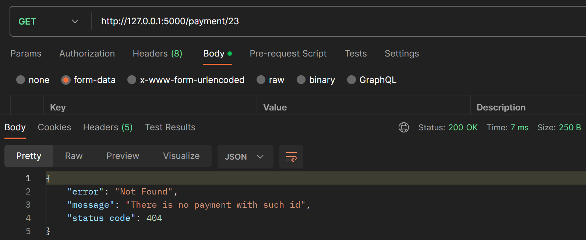

# Тестування працездатності системи

## Запуск сервера
 
 

## GET /payments
 

## GET /payment/\<id\>
 

## GET /payment/projectId/\<Projectid\>
 

## POST /payment/add
 
 

## PUT /payment/update
 
 

## DELETE /payment/delete/\<id\>
 
 

